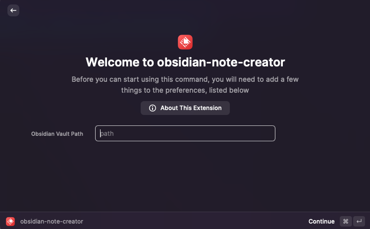
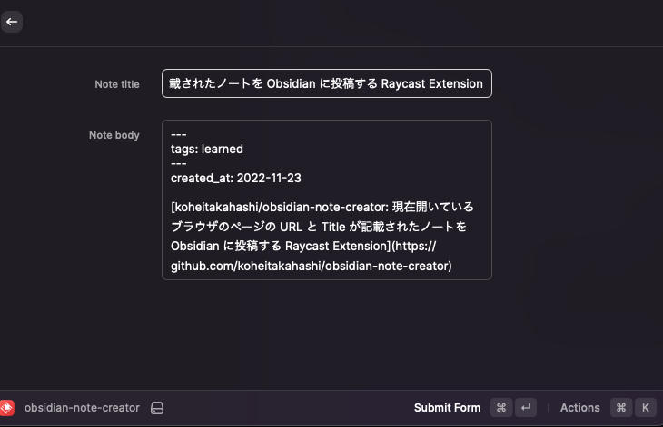

# obsidian-note-creator

現在開いている Web ページからタイトルと URL を取得して、それを元に以下のようなフォーマットで Obsidian にノートを作成する extension です。
(google chrome にのみ対応。)

作成されるフォーマット

```
---
tags: learned
---
created_at: yyyy-mm-dd

[開いているページのタイトル](開いているページの URL)
```

## 使い方

**1. このリポジトリをクローン**

```
git@github.com:koheitakahashi/obsidian-note-creator.git
```

**2. ローカルに持ってきた extension をビルド**

```
npm install && npm run build
```

**3. Obsidian のパスを登録**



**4. google chrome で Web ページを開いている状態で Raycast 上で「obsidian-note-creator」のコマンドを実行**

必要項目を入力して、cmd + enter をを押すと Obsidian にノートが追加されます。


